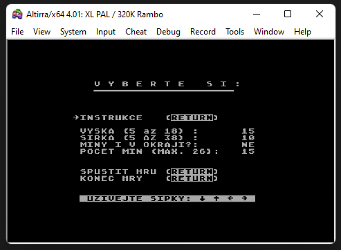

# Minesweeper for 8 bit ATARI XL/XE
 
Game known from Windows 3.11 (and perhaps later) made for 8 bit ATARI XL/XE in Action! language in early 90th.

This is splash screen shown after program loading:

After **START** key **menu** is displayed:

### Meaning of menu items:

> -> Instructions

> -> height of mine field (in characters)

> -> width of mine field (in characters)

> -> mines also in margin of field - NO/YES

> -> number of mines - depends on height and width of mine field

> -> start game

> -> end of game - go to DOS

### Instructions:

> Cursor movement - arrow keys without CTRL

> Discover field - SPACE key

> Mark mine - RETURN key

> Return to menu - ESC key

### Playing

This picture shows early beginning of game - 15 mines left:

Successfully recowered all mines - press any key:

Failure - some mine exploded - press any key:

### Comments:

File **[tiindata.act.txt](tiindata.act.txt)** contains data of splash screen and instructions data. The memory of Action editor was too low, so that is the reason why it is in separate file.

File **[miny12.act.txt](miny12.act.txt)** is main program.

